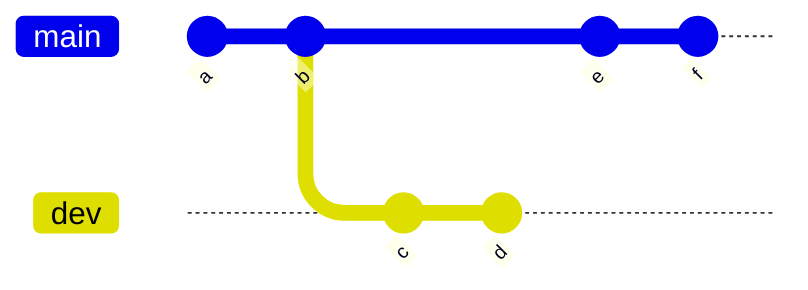
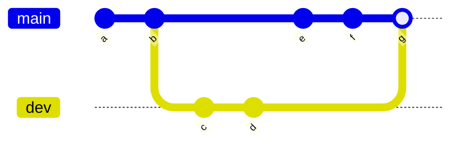
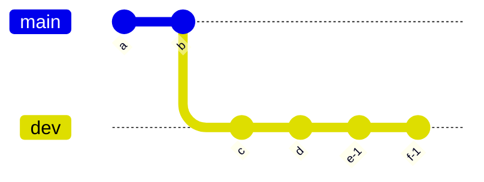

# Fork를 사용한 git 협업 작업

#### [Pull Request vs. Merge Request: Definition, Differences, Benefits, and More](https://www.simplilearn.com/pull-vs-merge-request-definition-differences-benefits-article)

#### [Github 공동작업을 위한 안전한 fork 사용법](https://engineering-skcc.github.io/github%20pages/github-pages-fork-1/)

#### [Merging vs. Rebasing](https://www.atlassian.com/git/tutorials/merging-vs-rebasing)

#### [merge의 종류 : fast-foward, 3-way-merge](https://wikidocs.net/153693)

#### [git playground](https://git-school.github.io/visualizing-git/#free)

Merging
- 2개의 branch를 합치기 위해서 2가지 방법이 있다. Merging과 Rebasing
- Merge

- git merge main dev

- 3-way merge : 서로 다른 commit의 공통 조상을 사용하여 3-way merge를 한다. merge commit이라고 한다.(fast-foward : 실제 merge 없이 최신 commit으로 이동하는 방식)
- merge의 장점은 기존의 branch 기록이 그대로 남아있어서 context를 이해하기 쉽다.
- 하지만 잦은 merge는 branch history를 지저분하게 만든다. 

Rebasing

- git rebase dev

- rebase는 branch history를 한 개의 라인으로 만든다는 장점이 있다.
- rebase시 주의할 점은 main이나 master branch에서 하면 안되고 side branch에서 해야 한다는 것이다.

Pull Request
- 원래 Git의 Pull이란 fetch와 merge의 조합으로 remote branch의 변경사항을 working directory에 적용하는 방법
- fetch는 원격 repository에 변경된 데이터를 모두 다운로드해서 받아오기만 하고 merge를 통해서 working directory를 변경한다.
- Pull Request는 Github와 Bitbucket에만 있는 고유의 기능
- Web 기반으로 작업을 제출하는 방식
- Pull Request란 이름은 프로젝트에 Pull을 하도록 요청한다는 뜻에서 나왔음.

Pull Request from forked repository
- fork한 repository에서 commit을 관리하고 PR을 등록하는 방법
- 별도의 독립된 repository에서 개발을 진행하기 때문에 기존 repository에서 문제가 발생할만한 소지가 줄어든다.

Pull Request from other branch
- branch에서 commit을 관리하고 PR을 등록하는 방법

