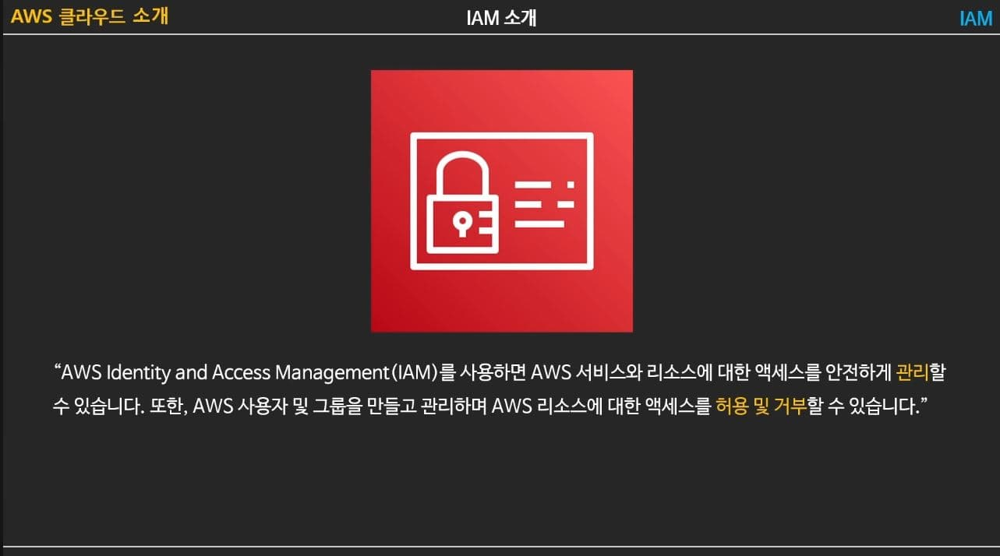
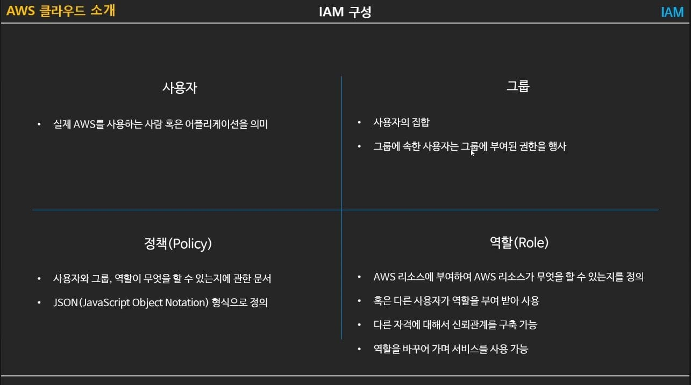
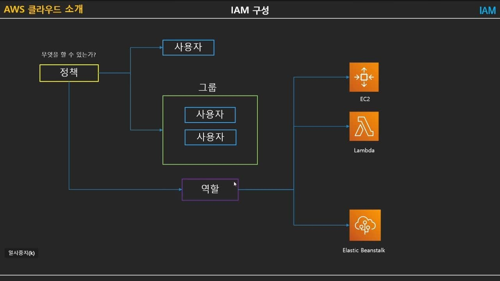
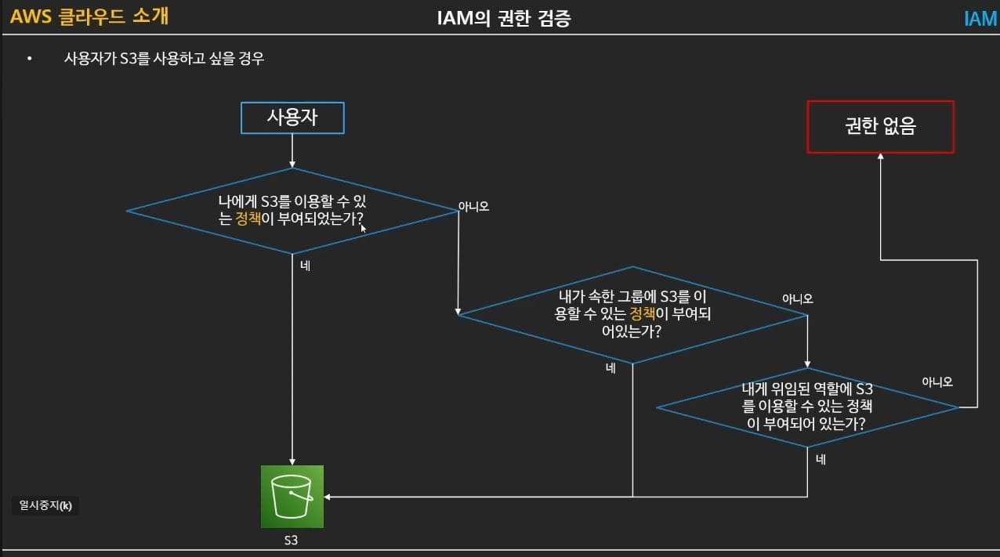
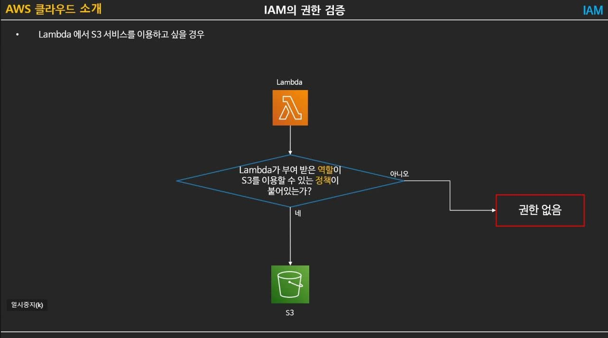
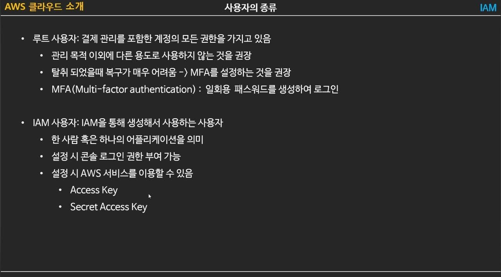
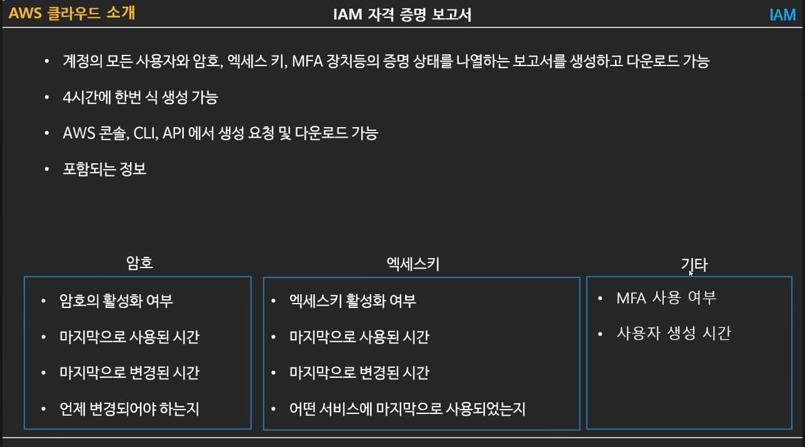
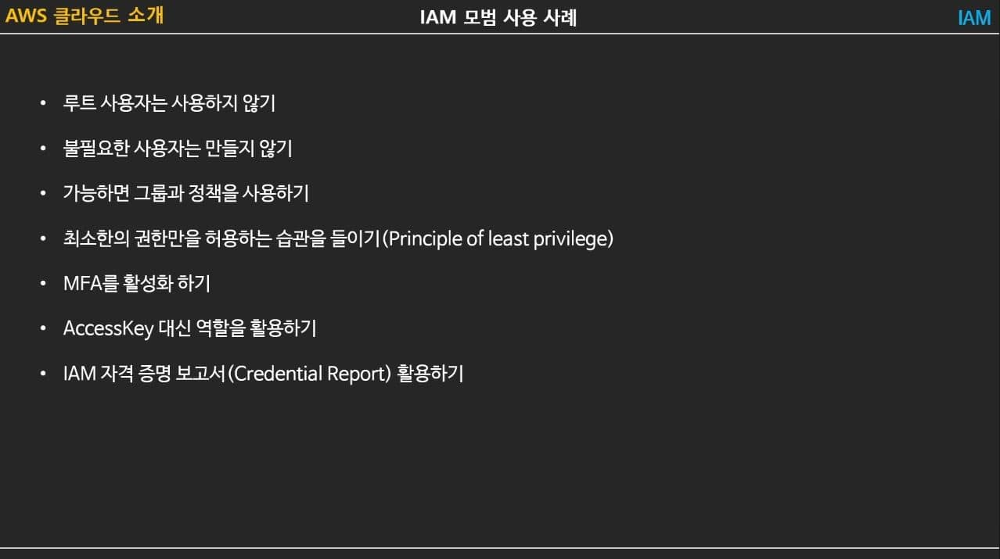

```
작성자: 서종원
날짜: 2023. 04.06
```

# IAM - 이론

## 목차 7 페이지, 총 1189 페이지

[PDF](https://docs.aws.amazon.com/ko_kr/IAM/latest/UserGuide/iam-ug.pdf#introduction) | [Link](https://docs.aws.amazon.com/ko_kr/IAM/latest/UserGuide/introduction.html)

## AWS IAM 서비스

200개가 넘는 서비스 -> 많은 권한 -> 권한 관리에 대한 부담 -> IAM

## Policy (정책)

- 여러 개의 서비스에 걸쳐서 복수의 권한을 한 번에 정의
- JSON 문서의 형태로 정의
- AWS에서는 수많은 권한 정책을 이미 정의, 관리 -> 필요에 따라 정의되어 있는 정책을 조합해서 사용가능

## User (사용자)

- 하나의 AWS 계정 아래에 여러 사용자
- 조직 구성원의 접근 통제
- 기본 사용자는 AWS의 최소 권한 원칙(Least Privilege Principle)에 따라 -> 아무런 권한 없음
- 2가지 방식으로 접근 권한 부여
  - 그룹(group)에 추가 (권장)
  - 직접적으로 정책(policy)를 연결
- AWS 계정을 처음 만들 때 생성되는 루트(root) 사용자 -> 해당 AWS 계정 내의 모든 리소스를 상대로 모든 작업을 할 수 있는 너무 강력한 권한 -> 개인 계정 또한 권한 분리 권장

## Group (그룹)

- 여러 구성원으로 이루어진 하나의 사용자 집단
- 관리자 그룹, DevOps 그룹, 개발자 그룹, DBA 그룹, QA 그룹 등
- 하나의 사용자 그룹에 여러 개의 권한 정책(policy)를 연결 가능 (1:N)

## Role (역할)

- 사용자(user)와 비슷한 개념. But, AWS에서 인증을 위해서 사용할 수 없음
- AWS 서비스에게 어떤 접근 권한을 위한 사용
- 예를 들어, EC2 인스턴스나 Lambda 함수가 AWS S3와 Dynamo DB에 접근해야한다면 역할을 통해서 관련 AWS의 API를 호출할 수 있도록 허용 (지난주 EB에서 사용!!!)
- 역할은 또한 여러 AWS 계정 간에 교차 접근 제어에도 사용 가능

## 쉽게 설명하는 AWS 기초 강좌 5: IAM 기초

[유튜브 링크](https://www.youtube.com/watch?v=hb_4Tf6bAtY)










# IAM - 실습

## IAM 자습서: 결제 콘솔에 대한 액세스 권한 위임

[IAM 자습서: 결제 콘솔에 대한 액세스 권한 위임](https://docs.aws.amazon.com/ko_kr/IAM/latest/UserGuide/tutorial_billing.html)


## 애플리케이션 개발을 위한 IAM 구성

https://catalog.us-east-1.prod.workshops.aws/workshops/3fd6c80b-39f2-4534-b69c-c400aed50c67/ko-KR/workshop-setting/iam-setting

# 관련된 추가 사항

## AWS configuare

- IAM Identity Center에서 ID를 관리하는 경우 AWS API에는 프로필이 필요하고 AWS Command Line Interface에는 프로필이나 환경 변수가 필요합니다.

- IAM 사용자가 있는 경우 AWS API 및 AWS Command Line Interface에는 액세스 키가 필요합니다. 가능한 경우 액세스 키 ID, 비밀 액세스 키 및 보안 인증 정보가 만료되는 시간을 나타내는 보안 토큰으로 구성된 임시 보안 인증 정보를 만듭니다.

## IAM Identity Center

- IAM에서 직접 만든 사용자와 다른 사용자 생성됨

```
AWS 액세스 포털 URL: https://d-906790cfde.awsapps.com/start
사용자 이름: cli-test
일회용 암호: Wr/&3J@83dkY<&h0J?D
```

## 참조

- https://docs.aws.amazon.com/ko_kr/IAM/latest/UserGuide/introduction.html
- https://docs.aws.amazon.com/ko_kr/IAM/latest/UserGuide/tutorial_billing.html
- https://dev.classmethod.jp/articles/what-is-aws-iam-kr/
- https://www.daleseo.com/aws-iam/
- https://www.youtube.com/watch?v=hb_4Tf6bAtY
