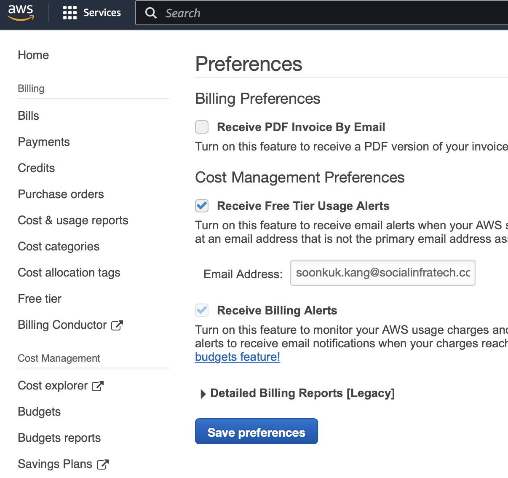

## CloudWatch Training
- AWS 프리 티어
  - AWS 프리 티어는 새로운 AWS 계정에서 특정 양과 유형의 리소스를 1년 동안 무료로 사용할 수 있는 기회를 제공하는 것.
  - 프리 티어에 포함되지 않는 모든 리소스의 양과 유형은 표준 요율에 따라 요금이 부과됨.
  - [프리 티어 에 포함된 리소스 확인](https://aws.amazon.com/ko/free/?nc1=h_ls&all-free-tier.sort-by=item.additionalFields.SortRank&all-free-tier.sort-order=asc&awsf.Free%20Tier%20Types=*all&awsf.Free%20Tier%20Categories=*all)
  - [AWS Budgets에서 프리 티어 사용을 모니터링하도록 opt in](https://console.aws.amazon.com/billing)

- [예상 AWS 요금을 모니터링하기 위한 결제 경보 생성](https://docs.aws.amazon.com/ko_kr/AmazonCloudWatch/latest/monitoring/monitor_estimated_charges_with_cloudwatch.html)
  - 결제 지표 데이터는 미국 동부(버지니아 북부) 리전에 저장되며 전 세계 요금을 나타냄.
  - 결제 경보를 생성하기 전에 Region(리전)을 US East (N. Virginia)(미국 동부(버지니아 북부))로 설정해야함.
  - 진행순서
    - 결제 알림 활성화
        
    - SNS topic 생성
      - SNS(Simple Notification Service)는 메시징(A2A, A2P)을 위한 완전관리형의 게시/구독 서비스
        
    - AWS 요금을 모니터링하고 결제 지표 데이터를 사용하는 Alarm 생성
