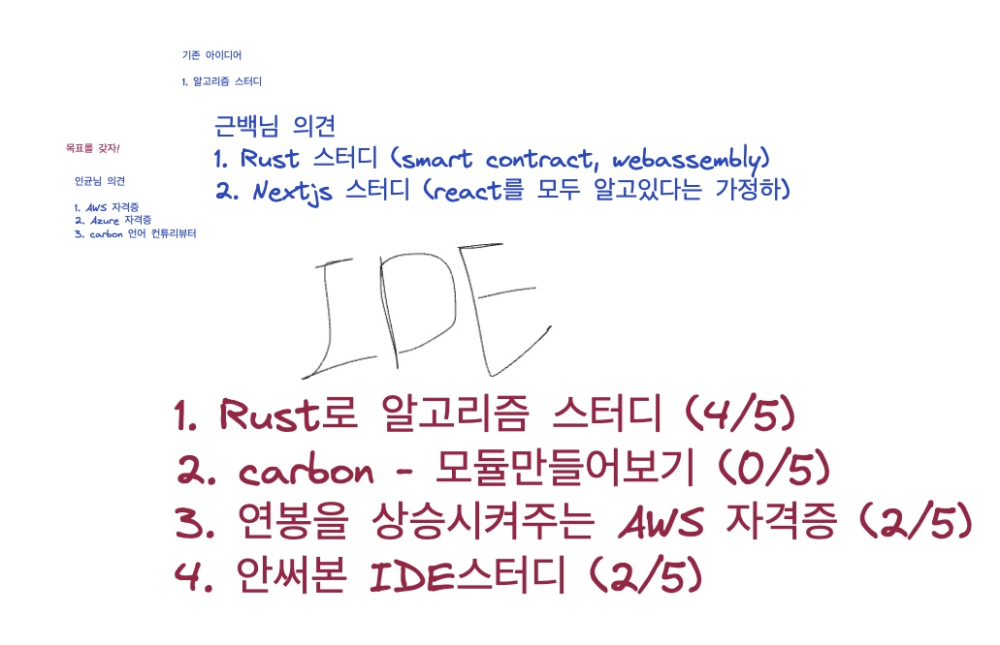

# Week1 - Round3 주제 선정

# [확정] Rust로 알고리즘 스터디

## 스터디 방법

1. https://leetcode.com/ 에서 초급 문제부터 하나씩 풀어보는 방법
2. 이후 syntax가 익숙해지면, 미리 문제를 풀어오고 알고리즘 풀이에 대한 리뷰
3. 질릴때까지 풀어보던지 2700개의 알고리즘을 다 풀던지...

## 레퍼런스

- https://www.acmicpc.net/problem/tags
- https://leetcode.com/problemset/all/
- https://excalidraw.com/#room=861f410865859d17e33f,GsdvBKTyafk9C46AC0dTtA
- https://www.acmicpc.net/problem/tags
- https://indosaram.github.io/rust-python-book/
- https://github.com/jsoverson/node-to-rust

